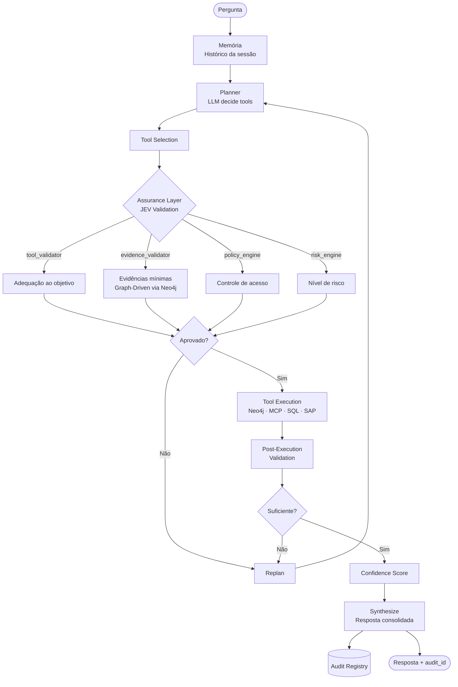

# Cellus Framework

Plataforma de agente de IA para plantas industriais que raciocina sobre **Knowledge Graph de ativos**, **dados operacionais em tempo real** e **fontes corporativas** — com memória de conversação, observabilidade integrada e uma camada de execução auditável e defensável.

Engenheiros de processo fazem perguntas em linguagem natural. O Cellus decide quais fontes consultar, executa as ferramentas, valida os resultados e entrega uma resposta consolidada com rastreabilidade de fonte.

Trocar de historiador é mudar uma linha no `.env`. Nenhum código muda.

---

## O que o Cellus faz

- **Raciocina sobre múltiplas fontes ao mesmo tempo** — Knowledge Graph (Neo4j), historiador industrial (PI, vNode, AVEVA via MCP), bancos relacionais, SAP, Databricks
- **Entende contexto de planta** — hierarquia de ativos, POPs, limites operacionais, instrumentos, decisões de processo
- **Mantém memória de conversação** — o engenheiro pode fazer perguntas de acompanhamento sem repetir contexto
- **Valida antes de executar** — a Assurance Layer (JEV) garante que o agente só executa ferramentas com evidências suficientes e dentro das políticas de acesso
- **Gera rastreabilidade completa** — cada resposta tem um registro de auditoria com fontes, confiança e validações
- **É extensível sem alterar o framework** — novos conectores, novas tools, novos domínios via herança e injeção de dependência

---

## Arquitetura

```
cellus/
├── core/
│   ├── agent.py          ← CellusAgent (fachada principal)
│   ├── planner.py        ← Decisão de tools via LLM (Tool Calling)
│   ├── nodes.py          ← Nós do workflow: planning, execute, synthesize
│   ├── workflow.py       ← Grafo LangGraph compilado
│   ├── state.py          ← AgentState compartilhado entre nós
│   └── assurance/        ← Assurance Layer (JEV Engine)
│       ├── jev_engine.py
│       ├── tool_validator.py
│       ├── evidence_validator.py
│       ├── risk_engine.py
│       ├── policy_engine.py
│       ├── confidence_engine.py
│       ├── audit_registry.py
│       ├── models.py
│       └── interfaces.py
├── connectors/    ← ToolConnector (base), Neo4jConnector, MCPConnector, SQLConnector
├── memory/        ← ConversationMemory (histórico por session_id)
├── api/           ← create_app() + rotas REST
├── utils/         ← build_llm(), logging, telemetry (LangSmith / OpenTelemetry)
└── settings.py    ← CellusSettings (extensível via herança)

industrial/        ← implementação de referência
├── graph/         ← Neo4jClient, cypher_queries, seed.cypher
├── tools/         ← LangChain Tools para Neo4j
├── mcp_server/    ← servidor MCP mock (substitua pelo historiador real)
├── prompts.py     ← persona do especialista industrial
└── settings.py    ← IndustrialSettings
```

---

## Fluxo do agente



---

## Capacidades principais

### Raciocínio multi-fonte

O agente consulta Neo4j, historiador e fontes corporativas em um único ciclo de raciocínio. O LLM decide quais ferramentas chamar — sem if/else de roteamento no código.

```
Pergunta → planning → execute → planning → ... → synthesize → Resposta
```

### Memória de conversação

Cada sessão mantém histórico entre turnos. O engenheiro pode perguntar *"e o C-102?"* sem repetir contexto.

```json
{ "question": "e o compressor C-102?", "session_id": "sala-controle-1" }
```

### Assurance Layer (JEV Engine)

Camada intermediária entre planejamento e execução que garante:

- **Evidências mínimas** — bloqueia execução se o contexto não tem as variáveis necessárias para responder ao objetivo
- **Controle de acesso** — nenhuma tool executa sem `policy_check == True` para o usuário e a fonte de dados
- **Classificação de risco** — tools de ação operacional são bloqueadas automaticamente; prescrições exigem aprovação humana
- **Rastreabilidade** — cada execução gera um `AuditRecord` recuperável via `GET /audit/{audit_id}`

| Nível | Permitido | Requer evidências | Requer aprovação humana | Bloqueado |
|-------|-----------|-------------------|------------------------|-----------|
| `INFO` | ✅ | ❌ | ❌ | ❌ |
| `DIAGNOSTIC` | ✅ | ❌ | ❌ | ❌ |
| `RECOMMENDATION` | ✅ | ✅ | ❌ | ❌ |
| `PRESCRIPTIVE` | ✅ | ✅ | ✅ | ❌ |
| `OPERATIONAL_ACTION` | ❌ | — | — | ✅ |

### Observabilidade

Suporte nativo a LangSmith (rastreamento de LLM) e OpenTelemetry (traces para Jaeger, Grafana, Datadog).

```env
LANGSMITH_API_KEY=...
LANGSMITH_PROJECT=cellus-industrial
OTEL_EXPORTER_OTLP_ENDPOINT=http://localhost:4317
OTEL_SERVICE_NAME=cellus-agent
```

---

## Setup

### Dependências

```bash
uv sync
uv sync --extra dev   # testes e cobertura
cp .env.example .env
```

### Execução

```bash
# 1. Carrega o Knowledge Graph
python app.py --seed

# 2. Sobe o servidor MCP mock (terminal separado)
python -m industrial.mcp_server.server

# 3a. CLI interativa
python app.py

# 3b. API REST
uvicorn main:app --reload
```

### Testes

```bash
pytest tests/ -v
pytest tests/ --cov=cellus --cov-report=term-missing
```

---

## Fontes de dados suportadas

| Fonte | Conector | Política padrão |
|-------|----------|-----------------|
| OSIsoft PI / AVEVA Historian | `MCPConnector` | `mcp_access`, `ot_read` |
| Neo4j (Knowledge Graph) | `Neo4jConnector` | `neo4j_read` |
| PostgreSQL / MySQL | `SQLConnector` | `sql_read` |
| SAP Datasphere | `SQLConnector` | `sap_access`, `erp_read` |
| Databricks | `SQLConnector` | `databricks_access`, `analytics_read` |

---

## Endpoints REST

| Método | Rota | Descrição |
|--------|------|-----------|
| POST | `/chat` | Pergunta ao agente (retorna `audit_id`, `confidence_score`) |
| POST | `/query` | Alias de `/chat` |
| GET | `/audit/{audit_id}` | Registro completo de auditoria da execução |
| DELETE | `/memory/{session_id}` | Limpa histórico da sessão |
| GET | `/health` | Status dos conectores |
| GET | `/tools` | Tools disponíveis agrupadas por fonte |

---

## Implementando um novo conector

```python
from cellus.connectors.base import ToolConnector
from langchain_core.tools import StructuredTool

class MinhaFonteConnector(ToolConnector):
    name = "minha_fonte"

    async def load_tools(self) -> list:
        def buscar_dados(query: str) -> str:
            """Busca dados operacionais."""
            return meu_banco.query(query)
        return [StructuredTool.from_function(buscar_dados)]
```

```python
agent = await CellusAgent.create(
    llm=build_llm(settings),
    connectors=[Neo4jConnector(...), MCPConnector(...), MinhaFonteConnector()],
    planner_prompt="...",
    synthesis_prompt="...",
)
```

Nenhum arquivo dentro de `cellus/` precisa ser alterado.

---

## Ativando a Assurance Layer

```python
from cellus.core.assurance import JEVEngine, PolicyEngine, FileAuditRegistry

jev = JEVEngine(
    neo4j_client=neo4j_client,
    audit_registry=FileAuditRegistry(),
    policy_engine=PolicyEngine(
        custom_permissions={"sala_controle": ["neo4j_read", "mcp_access", "ot_read"]}
    ),
    user_id="sala_controle",
)

agent = await CellusAgent.create(..., jev=jev)
```

### Registrando metadados de tools customizadas

```python
from cellus.core.assurance import register_tool, ToolMetadata, RiskLevel

register_tool(ToolMetadata(
    name="sap_get_consumption",
    purpose="Consultar consumo de insumos no SAP",
    domains=["sap", "erp", "consumo"],
    required_inputs=["material_code", "period"],
    returns=["consumption", "cost"],
    risk_level=RiskLevel.DIAGNOSTIC,
    data_source="sap",
    requires_policy=["sap_access"],
))
```
